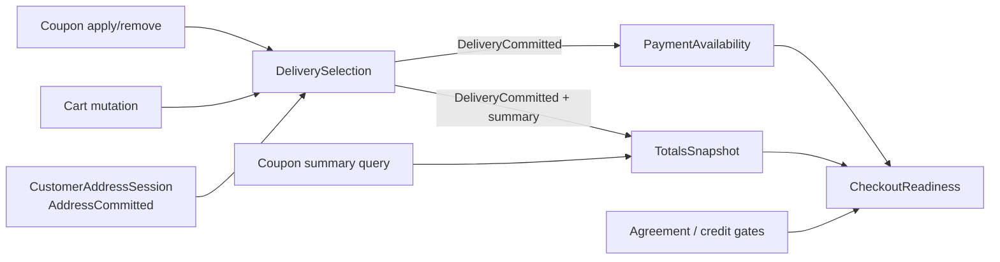

# CHECKOUT-009 Checkout State Consolidation Options

Date: 2026-07-29  
Codex config: model=Sol · effort=xhigh

## Decision required

Choose one implementation direction. No option in this document is authorized
for implementation, deployment, DB changes, commit or push by this audit.

Recommendation: **Option C — staged consolidation**.

It restores the intended semantics at the source without a rollback or a
symptom-only override, removes the two competing address-success writers, and
ships the cache correction immediately. That Stage 1 is a strict subset of the
target state design, so it does not become another temporary patch that must be
worked around later. Stage 2 can then replace the fragile hidden-input
authority and broad event bridges in a separately reviewable round.

## Non-negotiable invariants

All options preserve:

1. Guest-only stock checkout and logged-in checkout.
2. Warehouse, parcel locker and courier Nova Poshta modes.
3. Saved NP address hydration, validation and explicit repair.
4. One server-authoritative shipping quote/save selection.
5. ₴2,000 free shipping based on post-discount payable amount after coupon and
   mini-cart mutations.
6. Pinta tariff as display-only, never added to payable totals.
7. Manual coupon and First15 lifecycle.
8. Card, COD and IBAN methods.
9. Mono credit 3/4/5 terms and legitimate minimum/preorder blocks.
10. Disabled PUMB preview/skeleton.
11. Offer, comment, newsletter, account opt-in and receiver override.
12. Final guest reCAPTCHA and trusted-click-only order creation.
13. Deferred Telegram and CRM order side effects.
14. No SimpleCheckout re-exposure.

Before any option is implemented, obtain the schema-safe theme override export
and guest/logged-in HARs requested in the architecture map.

## Option A — targeted source corrections

### Design

Keep the current coordinator and hidden-input readiness model, but correct the
six mechanisms that directly create or conceal the current failure:

1. Make the coupon client carry the actual action (`summary`, `apply`,
   `remove`) into its renderer/state notification.
2. Treat `summary` as a query: cache its summary/free-shipping projection
   without revision advance, shipping/payment invalidation or requote.
3. Treat only successful `apply`/`remove` as totals mutations that invoke the
   existing coupon requote/resave path.
4. Replace Pinta's 250 ms quote call and the broad
   `ajaxSuccess` shipping-address URL matcher with one explicit
   address-save-completed callback into the coordinator.
5. Make guest register success run one named address transaction; its First15
   summary is a non-mutating query and cannot invalidate that transaction.
6. Publish both checkout scripts under a new immutable query key.

This is not an override. It edits/deletes the wrong source branches and leaves
one writer for the address → shipping transition.

### Expected files

- `catalog/view/javascript/checkout-reskin.js`
- `catalog/view/template/checkout/checkout.twig`
- `extension/PintaNovaPoshtaCod/catalog/view/template/shipping/js_checkout_shipping_address_form.twig`
- Possibly `catalog/view/javascript/checkout-state.js` only if the typed
  notification API is made explicit there instead of routing in reskin
- Hosting runner and diagnostic report in the separately authorized round

No controller/model/DB/payment-transport change is required.

### Deletes/replacements

- Delete unconditional `totalsChanged('coupon')` from generic `render()`.
- Delete Pinta `setTimeout(...bsCheckoutLoadShippingMethods..., 250)`.
- Delete broad URL-substring address-success ownership.
- Replace them with action-typed promo results and one explicit address
  completion.
- Replace the stale script query key.
- Leave the revision coordinator, hidden mirrors, coupon/cart requote/resave,
  atomic shipping summary and deferred confirm in place.

### Cost and blast radius

| Item | Assessment |
|---|---|
| Effort | Medium-high; approximately 1 implementation round plus owner QA |
| Code size | Small-to-medium, three or four live files |
| Checkout blast radius | Guest/logged-in bootstrap and address transitions; coupon summary/apply/remove |
| Payment blast radius | Indirect only through readiness recovery; no transport/controller change |
| NP blast radius | Client address-success integration only; no quote formula/API change |
| Long-term debt | Reduced, but hidden inputs and mixed Twig/JS ownership remain |

### Regression risks and controls

| Adjacent process | Risk | Required control |
|---|---|---|
| Initial First15 summary | Summary no longer triggers mutation path | Verify summary cache/free-shipping projection still renders |
| Coupon apply/remove | Typed route could fail to publish mutation | Verify one requote/save each and both threshold directions |
| Logged-in new address | Removing timer could expose missing explicit callback | Verify stock save and Pinta injected form each call the one callback |
| Saved-address change | Broad bridge removal could miss `.address` | Explicitly wire both save and selection response paths |
| Mini-cart | None intended | Replay quantity/remove threshold matrix |
| Payment/credit | Readiness timing changes | Replay card/COD/IBAN and Mono gate matrix |
| Analytics | Duplicate address/save observations may drop to one | Confirm one event per real save, not zero |

### Verification

1. Static marker/line accounting against all 40 register rows.
2. `node --check` on extracted changed JS bodies or standalone JS targets;
   PHP runner `php -l`.
3. Runner dry run on the new live source; exact anchors/hashes; backups.
4. Deterministic request-sequence test with delayed `coupon.summary` and delayed
   shipping save in both response orders.
5. Guest and logged-in HAR replay.
6. Register-derived browser matrix, cold and warm cache.
7. Owner final-order smoke only after all non-write gates pass.

### Rollback and bounded deployment

- One hosting runner backs up every target before write and restores all on any
  anchor/syntax failure.
- Cache clear and new immutable key are one deployment unit.
- Roll back all changed files together; do not roll back only the query key or
  only one writer deletion.
- Owner deploys to a branch/staging copy if available, then production;
  Codex does not deploy.

### Disposition accounting

Behaviour register: `34 preserved`, `6 replaced`, `0 removed`,
`0 UNKNOWN-PURPOSE`, `40/40 accounted`.

Replaced rows: `18`, `19`, `23`, `24`, `25`, `40`.

## Option B — consolidated checkout state layer

### Target design

Replace mixed ownership with **four single-responsibility processes** and one
thin compatibility projection:

1. **CustomerAddressSession**
   - owns register/saved/new-address commands;
   - emits one typed `AddressCommitted` result containing server fingerprint,
     address id and whether shipping/payment contexts changed;
   - never quotes shipping itself.
2. **DeliverySelection**
   - owns address/cart/coupon invalidation, quote request, selection and save;
   - one transaction id per cause;
   - commits a `DeliverySnapshot` only after the server save succeeds;
   - no timers or URL substring listeners.
3. **TotalsSnapshot**
   - query-only renderer/cache;
   - accepts shipping-save summary or explicit summary query;
   - coupon apply/remove is a command that publishes `TotalsChanged`; coupon
     summary never publishes a mutation.
4. **PaymentAvailability**
   - reads the committed `DeliverySnapshot` and server method response;
   - owns payment selection and credit availability;
   - publishes one `PaymentSnapshot`.
5. **CheckoutReadiness projection**
   - derives `delivery committed`, `payment committed`, agreement, CAPTCHA
     stage and credit block;
   - hidden inputs may remain temporarily for legacy Twig compatibility but
     have one writer and are never read as primary authority.

### Event contract

### Expected files

Likely live targets:

- new or rewritten `catalog/view/javascript/checkout-state.js`
- `catalog/view/javascript/checkout-reskin.js`
- `catalog/view/template/checkout/checkout.twig`
- `catalog/view/template/checkout/shipping_method.twig`
- `catalog/view/template/checkout/payment_method.twig`
- Pinta checkout JS integration template
- narrow response-shape additions in:
  - `catalog/controller/checkout/register.php`
  - `catalog/controller/checkout/shipping_address.php`
  - possibly `shipping_method.php`/`payment_method.php`

No bank transport, CRM worker, Telegram worker, schema or DB setting change is
required. If server response changes cross beyond the stated controllers, stop
and rescope.

### Deletes/replacements

- Delete business use of hidden-input reads as authority.
- Delete generic URL-substring `ajaxSuccess` ownership.
- Delete Pinta delayed quote timer.
- Delete duplicated direct writes to shipping/payment hidden mirrors.
- Replace `revision` calls scattered across handlers with one transaction API.
- Replace generic `totalsChanged(source)` with typed query/command results.
- Replace separate deferred-confirm checks with `CheckoutReadiness`.
- Retain a single compatibility adapter for existing Twig/payment fragments
  until they are migrated.

### Cost and blast radius

| Item | Assessment |
|---|---|
| Effort | High; multiple implementation/review rounds |
| Code size | Medium-to-large, six to nine live files |
| Checkout blast radius | Entire address/shipping/payment/totals lifecycle |
| Payment blast radius | Availability/selection integration, not transport |
| NP blast radius | Integration boundary only, but all three modes/saved addresses must replay |
| Long-term debt | Largest reduction; clear owners and typed events |

### Regression risks and controls

The primary risk is losing a defensive behaviour that works today. The 40-row
register is therefore a hard migration manifest, not a QA suggestion.

- Build adapters first, then move one cause at a time:
  address → shipping, coupon mutation, cart mutation, payment, readiness.
- Keep server contracts unchanged until client transaction tests pass.
- Add traceable transaction ids and reason codes (`bootstrap`, `address`,
  `coupon`, `cart`, `manual`) to diagnostics without logging PII.
- Compare legacy and new derived snapshots in a non-authoritative shadow mode
  on a fixture before cutover.
- Do not combine bank transport, CRM, fiscalization or DB changes with this
  migration.

### Verification

1. Unit/state-machine matrix for all transaction causes and response orderings.
2. Contract fixtures for register/address/quote/save/payment/coupon responses.
3. Marker-drop and deleted-line accounting linked to register rows.
4. Full guest/logged-in/saved-address/three-NP-mode behaviour replay.
5. Coupon and mini-cart threshold matrix at 1,999/2,000 and both crossing
   directions.
6. Basic payments and Mono minimum/preorder matrix.
7. Confirm/CAPTCHA/no-order-before-click assertions.
8. Deferred side-effect smoke after an owner-approved test order.
9. Cold/warm cache and mobile/desktop rendering passes.

### Rollback and bounded deployment

- Prefer two deployments:
  1. inert compatibility/shadow instrumentation;
  2. authority cutover after evidence matches.
- Each deployment uses one all-files backup and one versioned asset cutover.
- Keep the old adapter only for a bounded rollback window; do not keep two
  active authorities.
- Rollback switches authority as one unit and restores all changed templates,
  JS and response shapes.

### Disposition accounting

Behaviour register: `25 preserved`, `15 replaced`, `0 removed`,
`0 UNKNOWN-PURPOSE`, `40/40 accounted`.

Replaced rows: `11`, `15`-`21`, `23`-`27`, `32`, and `40`.

## Option C — staged consolidation

### Stage 1

Implement Option A's six source corrections, but expose the new entry points
with the names and typed cause/result contract of Option B:

- `AddressCommitted`
- promo result `{kind: "summary"|"apply"|"remove", mutated: boolean}`
- `DeliverySelection.requote(reason, selectionPolicy)`
- immutable new asset version

No shadow state store or server response rewrite is required yet. The existing
coordinator remains authoritative for this stage, but legacy timers and broad
listeners are removed.

### Stage 2

Migrate the remaining authority in this order:

1. `DeliverySnapshot` and one mirror writer.
2. `TotalsSnapshot` query/command split.
3. `PaymentSnapshot`.
4. `CheckoutReadiness`.
5. Remove compatibility hidden-input reads only after all consumers move.

Each step must be independently deployable and reversible. Do not begin Stage
2 under the authorization for Stage 1.

### Expected files, cost and blast radius

- Stage 1: Option A file set; medium-high effort and bounded blast radius.
- Stage 2: Option B file set, split across two or more separately authorized
  rounds.
- Total effort is slightly higher than a one-shot Option B due to adapters and
  repeated QA, but production risk per deployment is materially lower.

### Verification and rollback

- Stage 1 uses Option A's verification and one-unit rollback.
- Stage 2 uses Option B's shadow comparison, row accounting and authority
  cutover rollback.
- A Stage 1 implementation is accepted only if it introduces no temporary API
  that conflicts with the Stage 2 names/contracts.

### Disposition accounting

- Stage 1: `34 preserved`, `6 replaced`, `0 removed`,
  `0 UNKNOWN-PURPOSE`, `40/40`.
- Final target: `25 preserved`, `15 replaced`, `0 removed`,
  `0 UNKNOWN-PURPOSE`, `40/40`.

## Feature-preservation matrix

The detailed per-row disposition is authoritative in
`plans/CHECKOUT-009_checkout-behaviour-register_20260729.md`. This matrix
groups those rows into customer/business features.

| Feature / register rows | Option A | Option B | Option C |
|---|---|---|---|
| Guest identity/autosave (`1`) | Preserve | Preserve | Preserve |
| Guest offer (`2`) | Preserve | Preserve | Preserve |
| Save data/account opt-in (`3`) | Preserve | Preserve | Preserve |
| Newsletter (`4`) | Preserve | Preserve | Preserve |
| Receiver override (`5`) | Preserve | Preserve | Preserve |
| Logged-in default/saved address (`6`) | Preserve; replace only completion bridge | Preserve behaviour via `CustomerAddressSession` | Stage 1 bridge correction; Stage 2 named session process |
| NP warehouse/locker/courier (`7`) | Preserve | Preserve | Preserve |
| NP refs/hydration/repair (`8-9`) | Preserve | Preserve | Preserve |
| Quote prerequisites (`10`) | Preserve | Preserve | Preserve |
| Shipping auto-select/save (`11`) | Preserve current transaction | Replace with `DeliverySelection` | Preserve then migrate |
| Card/COD/IBAN (`12`) | Preserve | Preserve | Preserve |
| Mono credit and minimum/preorder blocks (`13`) | Preserve | Preserve | Preserve |
| PUMB disabled (`14`) | Preserve | Preserve | Preserve |
| Hidden readiness mirrors (`15`) | Preserve current model | Replace authority with snapshots | Preserve then migrate |
| Revision/stale guard (`16`) | Preserve | Replace with owned transaction id | Preserve then migrate |
| Address invalidation (`17`) | Preserve | Replace with named invalidation | Preserve then migrate |
| Coupon summary/apply/remove (`18-20`) | Replace classification; preserve actual mutation requote | Replace with command/query split | Stage 1 classification; Stage 2 split |
| Mini-cart requote (`21,30`) | Preserve | Replace orchestration, preserve trigger | Preserve then migrate |
| Pinta sole server writer (`22`) | Preserve | Preserve | Preserve |
| Duplicate Pinta/global writers (`23-24`) | Replace with one explicit callback | Replace with typed event | Stage 1 typed callback, retained target |
| Guest register ordering (`25`) | Replace with typed non-mutating summary | Replace with orchestrated flow | Stage 1 typed ordering; Stage 2 process |
| Bootstrap (`26`) | Preserve after semantic correction | Replace with `CheckoutBootstrap` | Preserve then migrate |
| Totals/deferred confirm/no phantom order (`27,34`) | Preserve | Replace renderer only; preserve order gate | Preserve then migrate renderer |
| ₴2,000 threshold after coupon/cart (`28`) | Preserve | Preserve | Preserve |
| Pinta display-only tariff (`29`) | Preserve | Preserve | Preserve |
| Order comment (`31`) | Preserve | Preserve | Preserve |
| Confirm composite gate (`32`) | Preserve | Replace client authority with server-backed readiness | Preserve then migrate |
| reCAPTCHA (`33`) | Preserve | Preserve | Preserve |
| Coupon/First15/success (`35-36`) | Preserve | Preserve | Preserve |
| Telegram/CRM (`37-38`) | Preserve | Preserve | Preserve |
| Analytics (`39`) | Preserve, remove duplicate action observations only | Preserve event contract | Preserve |
| Script cache version (`40`) | Replace key | Replace bundle/key | Replace in Stage 1 |

## Owner QA deployment sequence

For the chosen option, generate checks directly from register rows. Minimum
bounded order:

1. Pre-deploy: DB theme override export, clean dry run, backup paths, syntax
   gates, marker/line accounting.
2. Deploy all files for the selected stage as one unit and clear modification,
   template and relevant application caches.
3. Verify loaded script URLs use the new immutable key.
4. Guest, no address → full warehouse → payment; repeat locker and courier.
5. Logged-in default saved address and alternate saved address.
6. Coupon apply/remove below/above ₴2,000.
7. Mini-cart quantity/removal crossing ₴2,000 in both directions.
8. Card, COD, IBAN and Mono legitimate block matrix; PUMB remains disabled.
9. Comment, offer, newsletter, save-data and receiver behaviours.
10. reCAPTCHA/final trusted click with one owner-approved test order.
11. Confirm one order, one Telegram queue path and one deferred CRM sync.
12. Warm-cache repeat and rollback rehearsal.

## Decision summary

| Option | Production recovery speed | Architecture quality | Per-deploy risk | Residual debt |
|---|---|---|---|---|
| A | Fastest | Correct at the immediate source | Medium | Hidden-input/mixed ownership remains |
| B | Slowest | Strongest final model | High | Lowest |
| C | Fast recovery, planned follow-through | Same final target as B | Medium per stage | Low if Stage 2 is completed |

Choose **C** unless the owner explicitly prefers a one-round full state-layer
migration and accepts its broader checkout risk. Choose **A** only if the owner
does not intend to authorize consolidation after recovery.

